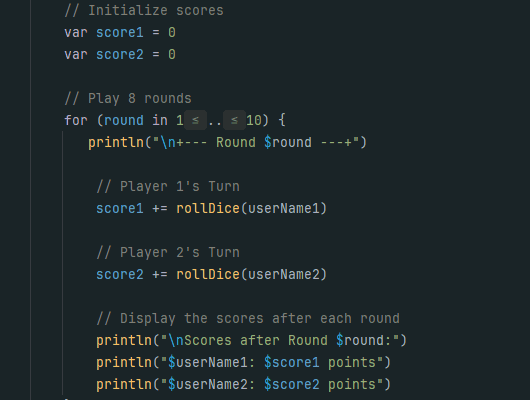
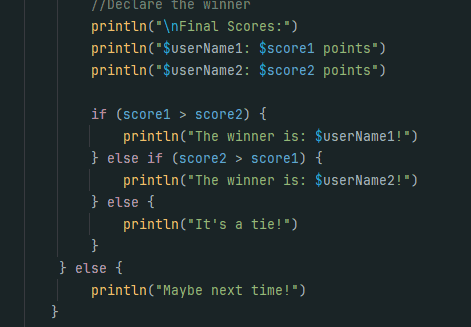
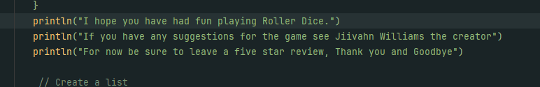

# Results of Testing

The test results show the actual outcome of the testing, following the [Test Plan](test-plan.md)

---

## Example Test Name

Testing to se if the print statement for the instructions work

### Test Data Used

By running the code it should print out all the instructions I have written in a neat format

### Test Result

the result is the same as I wanted 

---

## Example Test Name

Testing to see if players can take turns and make moves

### Test Data Used

By running the code it will show what I have expected

### Test Result

it came out how I liked it 

---

## Example Test Name

a test to see if the score system works

### Test Data Used

by running the code it will test it 

### Test Result

it's just as I expected

---

## Example Test Name

testing to see if it states who wins

### Test Data Used

by running the code it will test it 

### Test Result

it turned out exactly like I said

---

## Example Test Name

testing if it displays the final feedback

### Test Data Used

by running the code it will test it 

### Test Result

---
